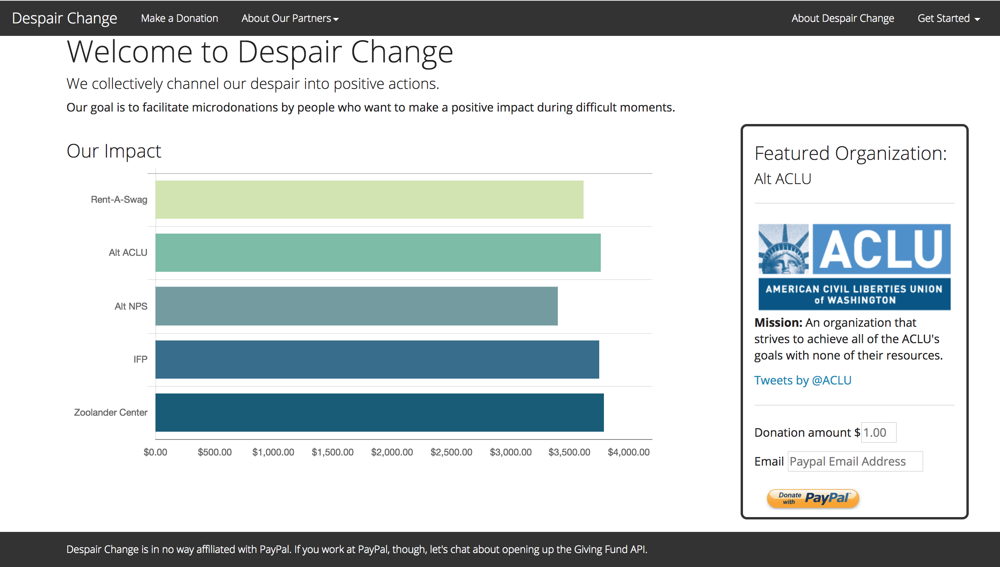
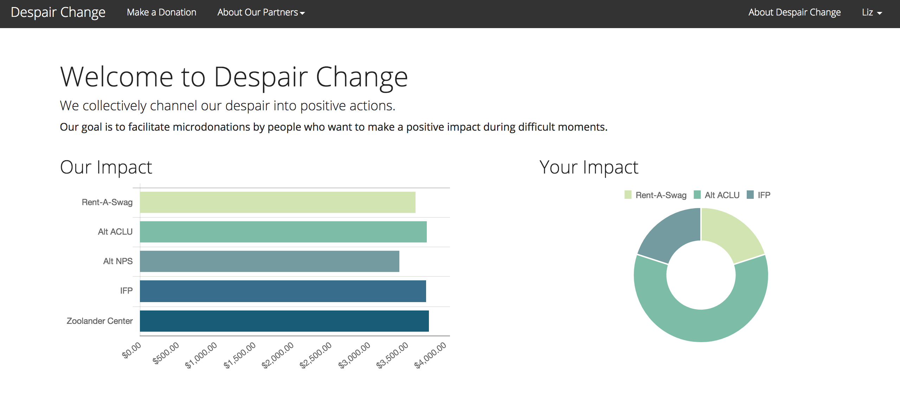
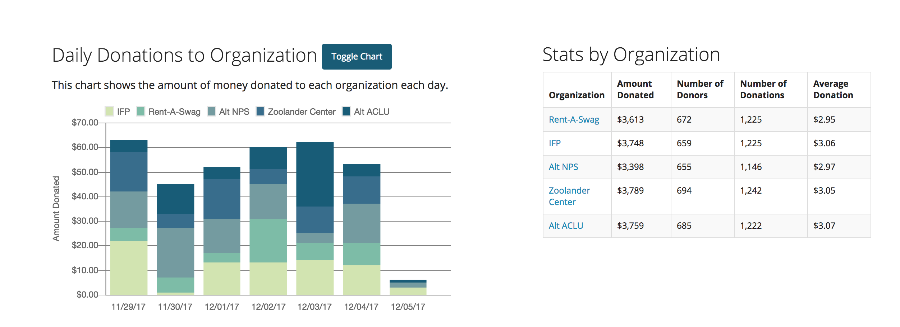
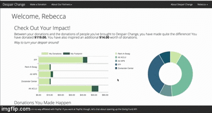
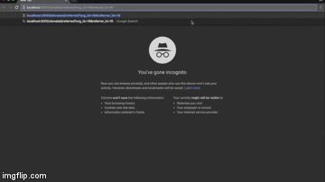

# Despair Change

Despair Change is a full stack donation app that integrates PayPal's REST API to streamline the process of making micro-donations. With just a few clicks, people can donate to their favorite organizations, increase the footprint of their impact by referring their friends to do the same, and see stats, charts, and graphs that show their donations as a part of a larger sum of money. Registered users can change their default donation amounts, adjust which organization shows up front and center on the donation page, and see their donation history sorted by organization and date. Non registered users can make donations, through the app either directly or via referral link from a registered user.

## Technologies Used

* Python
* Flask
* Flask SQLAlchemy
* Javascript/jQuery
* AJAX/JSON
* Jinja2
* PayPal REST API
* Chart.js
* HTML/CSS
* Bootstrap
* bcrypt

## Installation

To install Despair Change on your local machine, pip install -r requirements.txt. In order to make payments/process payments and interact with PayPal's REST API, you must source credentials from PayPal.

## Usage

There are three different payment routes through Despair Change. Non registered users can land on the homepage, make a donation through PayPal, and register as users if they so choose. Registered users can customize their default donation amount, which organizations show up first on their donate page, and refer their friends to click links that will send them straight to PayPal to make donations to the referrer's favorite organization. Referred users can register after their donation, and as a virtue of having been referred, every donation they make will be saved as a part of their referrer's total donation footprint.

The site is also filled with visuals that show how many small donations add up so that people donating just a dollar or two feel good about having a tangible impact instead of feeling inadequate for not donating the suggested amount of money on an organization's website.

This is what the homepage looks like when no one is logged in.

When a user is logged in, they see their impact on the homepage.

A user can see information about all donations made regardless of whether or not she is logged in.

If users want to make donations, they can click the donate button and see which organizations are available for donations.

This is what happens when a person types a referral link into their browser.

## Next Steps

Version 2.0 will (hopefully) leave the sandbox and connect donors to real organizations and include more ways for users to customize what kind of data they see about donations made through Despair Change.

## About the Developer

Becca Rosenthal is a software engineer living in Oakland, CA. She created Despair Change, her first project, during her fellowship at Hackbright Academy.
